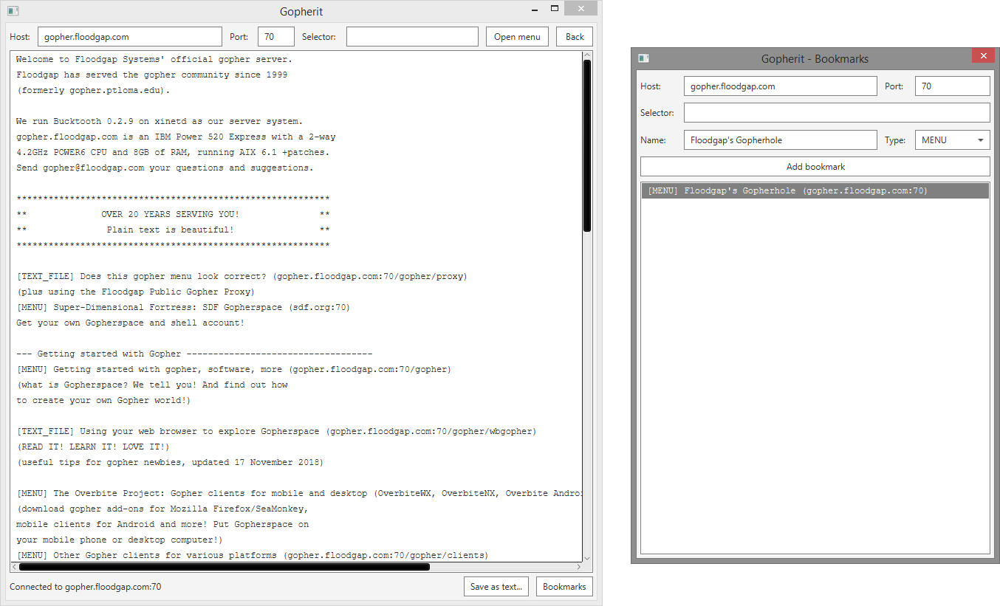

# Gopherit
Gopherit is a graphical [Gopher](https://en.wikipedia.org/wiki/Gopher_%28protocol%29) client made with Java.

## Features
* Graphical interface (JavaFX)
* History
* Bookmarks (using SQLite)
